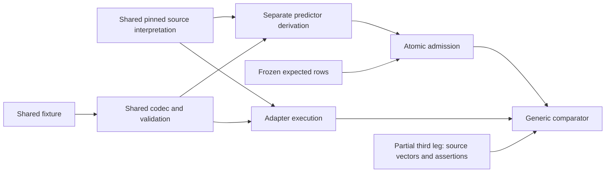

# H1 dependency graphs

Static imports and exact domain module/source lists are in the JSON companion. Dynamic exec, JS bundles and source wrappers were inspected manually. Module lists are not linear call chains; no formal noninterference claim is made.

## Crystal Receipt

Actual: `adapters/crystal_receipt/execute.mjs`, `adapters/crystal_receipt/model.py`, `adapters/crystal_receipt/__init__.py` -> observed result.

Expected: `profiles/crystal_receipt/expectation.py` -> prediction -> frozen admission.

Shared: `rsi/codec.py`, `runner/expectation_contract.py`, `runner/execution.py`, `runner/relation_runtime.py`, `profiles/crystal_receipt/source.py`, `profiles/crystal_receipt/relation.py`.

SPEC-derived equality/json.dumps vs snapshotCounterfactualSemanticJson + canonicalize + relation.observed. Source files and direct imports are enumerated in JSON. Third leg: Frozen SPEC, V-SEM-MANIFEST-INVARIANT, mutation vector, direct canonical-string assertions.

## RVR digest-binding

Actual: `adapters/rvr/model.py`, `adapters/rvr/__init__.py` -> observed result.

Expected: `profiles/rvr/expectation.py` -> prediction -> frozen admission.

Shared: `rsi/codec.py`, `runner/expectation_contract.py`, `runner/execution.py`, `runner/relation_runtime.py`, `profiles/rvr/source.py`, `profiles/rvr/relation.py`.

Independent functions implementing same Rule/Scope predicates, canonical JSON/SHA256; adapter execs amendment_gate and verdict_binding_gate. Source files and direct imports are enumerated in JSON. Third leg: 14 source vectors and explicit unsupported/layer assertions; shared upstream provenance.

## TSEI serializer/adoption

Actual: `adapters/tsei/encoder.mjs`, `adapters/tsei/model.py`, `adapters/tsei/__init__.py` -> observed result.

Expected: `profiles/tsei/expectation.py` -> prediction -> frozen admission.

Shared: `rsi/codec.py`, `runner/expectation_contract.py`, `runner/execution.py`, `runner/relation_runtime.py`, `profiles/tsei/source.py`, `profiles/tsei/relation.py`.

json.dumps/hash + hard-coded chronology membership vs TS encoder, source record validator and pinned record/chronology. Source files and direct imports are enumerated in JSON. Third leg: 48 serializer vectors, fixed digests and Git/record evidence; chronology interpretation still shared.

## PQ policy/as-of

Actual: `adapters/pq/model.py`, `adapters/pq/__init__.py` -> observed result.

Expected: `profiles/pq/expectation.py` -> prediction -> frozen admission.

Shared: `rsi/codec.py`, `runner/expectation_contract.py`, `runner/execution.py`, `runner/relation_runtime.py`, `profiles/pq/source.py`, `profiles/pq/relation.py`.

Sorted governing-binding obligations vs pinned cutoff_enforce.admit/resolve_in_force and deep_recompute. Source files and direct imports are enumerated in JSON. Third leg: 21 source policy vectors and direct historical/unsupported assertions; common source lineage.

## TAS context/dispatch

Actual: `adapters/tas/execute.mjs`, `adapters/tas/model.py`, `adapters/tas/__init__.py` -> observed result.

Expected: `profiles/tas/expectation.py` -> prediction -> frozen admission.

Shared: `rsi/codec.py`, `runner/expectation_contract.py`, `runner/execution.py`, `runner/relation_runtime.py`, `profiles/tas/source.py`, `profiles/tas/relation.py`.

Tuple/address/membership obligations vs pinned gate/service/manifest with controlled resolver and SDK invoke port. Source files and direct imports are enumerated in JSON. Third leg: Pinned production source and direct dispatch/member assertions; no full external third leg.

## ConsultEscrow

Actual: `adapters/consult_escrow/execute.mjs`, `adapters/consult_escrow/model.py` -> observed result.

Expected: `profiles/consult_escrow/expectation.py`, `profiles/consult_escrow/crypto.py` -> prediction -> frozen admission.

Shared: `rsi/codec.py`, `runner/expectation_contract.py`, `runner/execution.py`, `runner/relation_runtime.py`, `profiles/consult_escrow/source.py`, `profiles/consult_escrow/relation.py`.

Keccak/secp256k1 and state predicates vs source bytecode/ecrecover/storage/transfer execution. Source files and direct imports are enumerated in JSON. Third leg: Keccak KATs, fixed signatures, source contract; EVM is actual leg, not automatically a third full oracle.

## verify-layer

Actual: `adapters/verify_layer/execute.mjs`, `adapters/verify_layer/model.py`, `adapters/verify_layer/__init__.py` -> observed result.

Expected: `profiles/verify_layer/expectation.py`, `profiles/verify_layer/oracle.py` -> prediction -> frozen admission.

Shared: `rsi/codec.py`, `runner/expectation_contract.py`, `runner/execution.py`, `runner/relation_runtime.py`, `profiles/verify_layer/source.py`, `profiles/verify_layer/relation.py`.

Custom Python nibble/path/leaf obligations vs JS verifier with offline RPC replay. Source files and direct imports are enumerated in JSON. Third leg: Real supplied proof, Keccak KATs and direct root/account/balance assertions; no independent authoritative header.

## Legacy/synthetic

Actual: `adapters/generic/model.py`, `adapters/messaging/model.py`, `rsi/wire.py` -> observed result.

Expected: `profiles/synthetic.py`, `rsi/oracle.py` -> prediction -> frozen admission.

Shared: `rsi/codec.py`, `runner/expectation_contract.py`, `runner/execution.py`, `runner/relation_runtime.py`.

rsi.oracle predicates vs separate adapters; inspect vs wire.valid_signature use same cryptography and codec. Source files and direct imports are enumerated in JSON. Third leg: Contract and direct scenario assertions; expected artifact is oracle-generated, not independent origin.

PQ vector-test shared node: source `apply_revocations` -> BOTH actual and predictor binding history; actual resolved key -> predictor test snapshot_key. This is test preprocessing, not the registered production expectation path.
