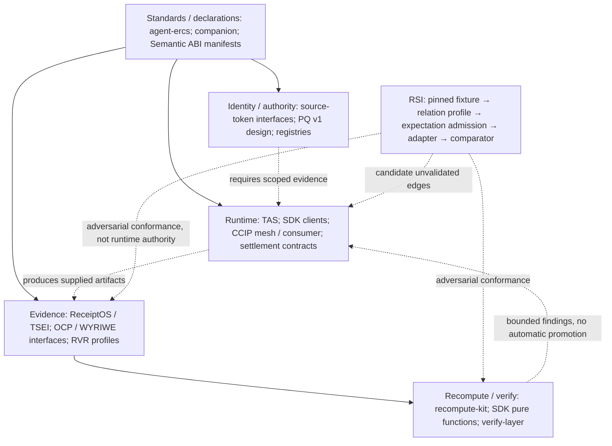

# Trustless AI cross-repo conformance map v0

## Assessment

**SUPPORTED, narrowly:** RSI functions as an implementation-facing cross-repo conformance plane for the currently admitted Trustless AI relation surfaces. Four materially different source-defined families execute through one generic architecture with pinned source evidence, independently admitted expectations, mapped mutations and explicit unsupported boundaries. **Ecosystem-wide coverage is PARTIALLY SUPPORTED**: most actual producer/consumer edges below have no RSI fixture.

The candidate thesis holds for these bounded surfaces: repositories own their semantic contracts; RSI challenges whether locally valid components preserve the relation before dependent claims are promoted. It does not make RSI the source of authority, prove deployed integration, or verify all repositories. The 20 mapped edges include two discovery-only edges; they are not 20 validated integrations.

RSI inspection HEAD: `5e964b0335b42d1f8e298bb8b6afdbead6254f5a`, private `main`. This commit adds only five research files. No code, schemas, profiles, fixtures or mutation records change. External sources were read as exact canonical GitHub blobs; no external repository was modified and no external test or deployment was executed. Canonical here means the repository's current default branch, not inferred protocol finality. TAS explicitly defaults to `feature/tas-poc`.

The Memory Palace was read for navigation; it is stale relative to this live RSI state and was not treated as authority. The task's RSI-only write boundary leaves it unchanged.

## Validated scope

| Family / profile | Checks / kills | Established scope | Limit |
| --- | --- | --- | --- |
| Crystal Receipt / crystal-receipt.v0 | 4 / 3 | accepted semantic-snapshot equivalence; audit_timestamp mirror; protected substitution | Not general provenance, admission, Lane K or whole ReceiptOS. |
| RVR digest / rvr.digest-binding.v0 | 10 / 6 | amendment/verdict digest binding, effective continuity, layer-specific unresolved and crypto non-promotion | No signature authenticity for these amendment/verdict vectors; not whole RVR. |
| TSEI serializer/adoption / tsei.serializer-adoption.v0 | 7 / 6 | serializer identity, mechanism/adoption/record introduction, finite-snapshot non-retroactivity | No provenance-authority recomputation; exact historical snapshots, not arbitrary ancestry. |
| PQ policy/as-of / pq.policy-asof.v0 | 7 / 7 | conditional cutoff/governing history, historical/current distinction, stale snapshot, claim non-promotion | Supplied history and anchor/signature flags; no independent anchors or authenticated chain; not PQ v1. |

The remaining 36 checks are the legacy synthetic corpus. Of 45 total kills, 23 cover legacy/Expectation/Relation Profile architecture and 22 cover the four domains. These are mapped decision failures, not proof of exhaustive coverage. Crystal's two negative mutations overlap; several later-domain mutations test explicit non-promotion guards. No mutation count establishes independent authorship or completeness.

Current domain evidence and exact execution rows remain in the unchanged [Crystal](crystal-receipt-validation-v0.md), [RVR](rvr-digest-binding-validation-v0.md), [TSEI](tsei-serializer-adoption-validation-v0.md), and [PQ](pq-policy-asof-validation-v0.md) reports and their source maps. Their top-level PASS means observed behavior matches admitted expectation, not that every embedded capability is proven.

## Layered architecture

Arrows are architecture relations classified in the matrix, not claims of deployed wiring. Repositories span layers: agent-ercs includes a settlement implementation; SDK recomputes as well as invokes; ReceiptOS and Semantic ABI already own conformance functions. `primitives` and `.github` are discovery/coordination surfaces, not security roots.

**Semantic ABI** checks typed claim + authority + scope + temporal compatibility and also has its own adapter/pair-conformance runner. **RSI** supplies source-pinned adversarial fixtures with atomic expectation admission and mutation evidence. Their roles overlap in conformance; they are not wired together here, and neither substitutes for the other's contract. Semantic ABI remained strictly read-only. [S051: trustless-ai/semantic-abi/runner/src/linker.mjs](https://github.com/trustless-ai/semantic-abi/blob/d15c666dfccff17f7350fe97d2fc7b71cb2cbaee/runner/src/linker.mjs)

**ReceiptOS** packages supplied execution evidence and recomputes declared artifact properties, with its own frozen conformance profiles. It is not RSI storage, nor an automatic source-truth/occurrence authority. RSI currently challenges one accepted semantic-snapshot relation and a TSEI serializer adoption seam. [S005: pipavlo82/crystal-receipt/README.md](https://github.com/pipavlo82/crystal-receipt/blob/45b46bf7df3a60b32583291f577a36bf19d22f00/README.md)

**ERC-8309/base reference** preserves evidence and exposes divergence; the **companion** defines a resolution-policy layer; **RVR** owns neighboring profile/evidence/result receipt bindings. RSI's current recompute-kit digest lane must not fuse these into one system. A retains effective A without establishing transition acceptance; Profile A resolves nothing; verdict-profile binding does not establish judgment correctness. The consumer HEAD advanced, but the inspected `vantage_resolution.py` hash is unchanged from the earlier pin. Version labels remain distinct, so whole current-companion compliance is not asserted.

## Proof of reuse

The historical Git diff from Relation Profile architecture HEAD `30e13ba3a39915c91a607f70975c669ead7a231e` to inspection HEAD is empty for `runner/`, `rsi/`, and `schema/`. Earlier architecture work did add the profiled path; zero changes refers to admission of the four domains after that architecture existed, not to the entire project history.

`extensions/pq.complete_composition` composes the prior domain registrations. `runner.relation_runtime.execute` resolves exact relation profiles, then calls `runner.extension_runtime.execute`; `runner.execution.run_profile` performs atomic expectation admission and compares encoded actual output to the admitted observation. The same result states remain PASS, FAIL, INVALID_FIXTURE and UNSUPPORTED. Source-specific semantics reside in profiles/adapters/registration tables, not generic branches. `tests.test_pq.PQTests.test_same_pipeline_four_domains` and the full suite were rerun. Exact generic file hashes are in the JSON report.

Expectation-file hashes alone do not authorize truth. Predictor agreement and atomic admission remain required. Function identity/no-call checks and mutation tests are useful but cannot certify logical or author independence. See the dedicated review in the gaps report.

## Canonical repository pins

| Repository | Canonical branch | Exact HEAD | Coverage |
| --- | --- | --- | --- |
| trustless-ai/agent-ercs | main | 01283ca57305f915afb560d23359a27fd748eb5a | mapped but unvalidated |
| trustless-ai/agent-sdk | main | e41b117893fb56bc869922de378daf91aad63def | mapped but unvalidated |
| trustless-ai/recompute-kit | main | 15f7f59ac47b3358492bd5741143c418b5d657f5 | partially validated |
| trustless-ai/ccip-router | main | 6bd66611b88a4751a0acc233c718aa9a13294de4 | mapped but unvalidated |
| trustless-ai/semantic-abi | main | d15c666dfccff17f7350fe97d2fc7b71cb2cbaee | mapped but unvalidated |
| trustless-ai/trustless-agent-substrate | feature/tas-poc | a344ef80f7c52c03b9183814d1874b8054639c3e | mapped but unvalidated |
| trustless-ai/pq-agent-binding | main | 4f934ad31e96979002d818cd8a5f12909c1b6713 | mapped but unvalidated |
| trustless-ai/verify-layer | main | 84afc4b738dc37269089c858404eed8086435f5d | mapped but unvalidated |
| trustless-ai/primitives | main | 6b39e9540d4bd0a78decb588c0a8e328c303f208 | mapped but unvalidated |
| trustless-ai/.github | main | 63fcf1911eeb129e71919a3f629e8fc08dc56b9d | README/architecture only |
| pipavlo82/crystal-receipt | main | 45b46bf7df3a60b32583291f577a36bf19d22f00 | partially validated |
| pipavlo82/recomputable-verification-receipts | main | 287c0ea1c2578c1833405bc2476975f95addbada | partially mapped; separate RSI digest lane only |
| damonzwicker/erc8309-companion-drafts | main | f5f36778e7cbf6c26fd61a7d66b70b9108447746 | mapped but unvalidated |
| babyblueviper1/invinoveritas | main | 76d19dc394b208d01ba368382b3e5f4f2c18f0ee | mapped but unvalidated |

The 14 external repositories comprise all ten requested Trustless AI repos plus Crystal Receipt, RVR, companion drafts and reference consumer. TSEI is a component spanning Crystal/recompute-kit, not a separately invented repository. This is file-level inspection coverage, not 14 validated repos. Only selected Crystal/recompute-kit surfaces execute in RSI; direct runtime consumers, contracts, PQ v1 and Semantic ABI remain unvalidated by RSI.

## Validation and source limits

Before document generation: 337 tests, 337 optimized tests, 64 PASS, 45 KILLED; all other result/mutation classes zero. Prior 45 mutation records matched the Phase 2D records exactly. All 239 pre-existing tracked-file hashes match, containing the earlier 202 protected set. Post-document reruns also passed 337 tests, 337 optimized tests and 64 checks with exact structured outcome diff 0 and all 239 hashes unchanged. Exact commit CI is recorded in the delivery response and ignored run logs; the committed machine report does not predict its own commit SHA or CI result.

No actual external transaction, contract deployment, RPC credential access, publication, tag, release or PR was performed. Source README production/audit claims remain upstream claims. The synthesis does not claim universal security, complete semantics, mathematical novelty or all Trustless AI repos verified.

## Deliverables

- [Repository/relation/ownership matrix](trustless-ai-relation-matrix-v0.md)
- [Unsupported capabilities, promotion boundaries, independence and transport gaps](trustless-ai-validation-gaps-v0.md)
- [Three proposed next phases](trustless-ai-next-phases-v0.md)
- [Machine-readable map, all source paths/digests and mutation records](trustless-ai-cross-repo-map-v0.json)
